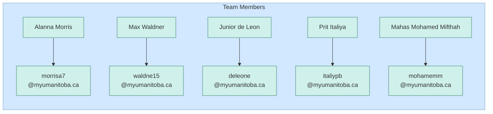

# Wealth Wise App

## Project Overview
WealthWise is a financial tracking Android app designed to help users practice mindful spending and budgeting. The app allows users to:
- Create personal accounts
- Track income streams and expenses with categories
- View financial data through charts and graphs
- Update your information and review past transactions
- Compare your finances over weeks, months, or the whole year

## How to Run

### Requirements
- Android Studio
- Android SDK (minimum API level 24)
- JDK 11 or higher

### Installation and Setup
1. Clone the repository:
   ```
   git clone https://code.cs.umanitoba.ca/comp3350-winter2025/a01-g11-code-kages.git
   ```
2. Open the project in Android Studio
3. Sync Gradle files
4. Run the application on an emulator or physical device

## Main Screens
- **Home Dashboard**: Your welcoming dashboard showing your monthly financial health at a glance.
- **Analytics Dashboard**: Explore your finances with charts and graphs that show weekly, monthly, or yearly summaries.
- **Tracking Dashboard**: Add, edit, or delete income and expense entries to keep your records up to date.
- **Profile Dashboard**: Update your personal information or delete your account if needed.

## Recent Release Information
The most recent release (Iteration 3) includes:
### Analytics Dashboard
View your financial data through pie charts and bar graphs:
- **Summary Analytics Feature**: Compare income to expenses with colorful graphs and charts that show the big picture.
- **Income Analytics Feature**: See where your money comes from and which earnings add most to your wallet.
- **Expense Analytics Feature**: See where your money goes to and which expenses take most from your wallet.
- **Time-based Analytics**: Switch between weekly, monthly, or annual views in any of the above features to track your progress over different time periods.

## Important Documentation
- [VISION.md](https://code.cs.umanitoba.ca/comp3350-winter2025/a01-g11-code-kages/-/blob/main/Documents/Iteration0/vision.md)
- [ARCHITECTURE.md](https://code.cs.umanitoba.ca/comp3350-winter2025/a01-g11-code-kages/-/blob/main/Documents/Iteration3/arch_diagram_3.md)
  - [Architecture Diagram (PDF)](https://code.cs.umanitoba.ca/comp3350-winter2025/a01-g11-code-kages/-/blob/main/Documents/Iteration3/arch_diagram_it3.pdf?ref_type=heads)
- [RETROSPECTIVE.md](https://code.cs.umanitoba.ca/comp3350-winter2025/a01-g11-code-kages/-/blob/main/Documents/Iteration3/it3-retrospective.md)
- Tests:
  - [Unit Tests](https://code.cs.umanitoba.ca/comp3350-winter2025/a01-g11-code-kages/-/blob/main/app/src/test/java/comp3350/wwsys/tests/AllTests.java?ref_type=heads)
  - [Integration Tests](https://code.cs.umanitoba.ca/comp3350-winter2025/a01-g11-code-kages/-/blob/main/app/src/test/java/comp3350/wwsys/tests/AllIntegrationTest.java?ref_type=heads)
  - [Acceptance Tests](https://code.cs.umanitoba.ca/comp3350-winter2025/a01-g11-code-kages/-/blob/Develop/app/src/androidTest/java/comp3350/wwsys/tests/acceptance/AllAcceptanceTests.java?ref_type=heads)

## Other Useful Links
  - [Presentation](https://prititaliya.github.io/presentation/)

## Iteration Documents
For the markers:
- [Iteration 0](https://code.cs.umanitoba.ca/comp3350-winter2025/a01-g11-code-kages/-/tree/main/Documents/Iteration0?ref_type=heads)
- [Iteration 1](https://code.cs.umanitoba.ca/comp3350-winter2025/a01-g11-code-kages/-/tree/main/Documents/Iteration1?ref_type=heads)
- [Iteration 2](https://code.cs.umanitoba.ca/comp3350-winter2025/a01-g11-code-kages/-/tree/main/Documents/Iteration2?ref_type=heads)
- [Iteration 3](https://code.cs.umanitoba.ca/comp3350-winter2025/a01-g11-code-kages/-/tree/main/Documents/Iteration3?ref_type=heads)

## Iteration Milestones
- [Iteration 1](https://code.cs.umanitoba.ca/comp3350-winter2025/a01-g11-code-kages/-/milestones/1#tab-issues)
- [Iteration 2](https://code.cs.umanitoba.ca/comp3350-winter2025/a01-g11-code-kages/-/milestones/2#tab-issues)
- [Iteration 3](https://code.cs.umanitoba.ca/comp3350-winter2025/a01-g11-code-kages/-/milestones/3#tab-issues)
- [Iteration 4](https://code.cs.umanitoba.ca/comp3350-winter2025/a01-g11-code-kages/-/milestones/4#tab-issues)

## Features
- [Feature List](https://code.cs.umanitoba.ca/comp3350-winter2025/a01-g11-code-kages/-/issues/?label_name%5B%5D=Feature)

## User Stories
- [User Story List](https://code.cs.umanitoba.ca/comp3350-winter2025/a01-g11-code-kages/-/issues/?label_name%5B%5D=User%20Story)

## Developer Tasks
- [Developer Task List](https://code.cs.umanitoba.ca/comp3350-winter2025/a01-g11-code-kages/-/issues/?sort=priority&state=all&label_name%5B%5D=Developer%20Task&first_page_size=100)

## Architecture Diagrams
- [Iteration 1: Architecture Drawing](Documents/Iteration1/Architecture.md)
- [Iteration 2: Architecture Drawing](Documents/Iteration2/it2_architecture_diagram.md)
- [Iteration 3: Architecture Diagram (MD)](https://code.cs.umanitoba.ca/comp3350-winter2025/a01-g11-code-kages/-/blob/main/Documents/Iteration3/arch_diagram_3.md)
- [Iteration 3: Architecture Diagram (PDF)](https://code.cs.umanitoba.ca/comp3350-winter2025/a01-g11-code-kages/-/blob/main/Documents/Iteration3/arch_diagram_it3.pdf?ref_type=heads)

# Our Team

